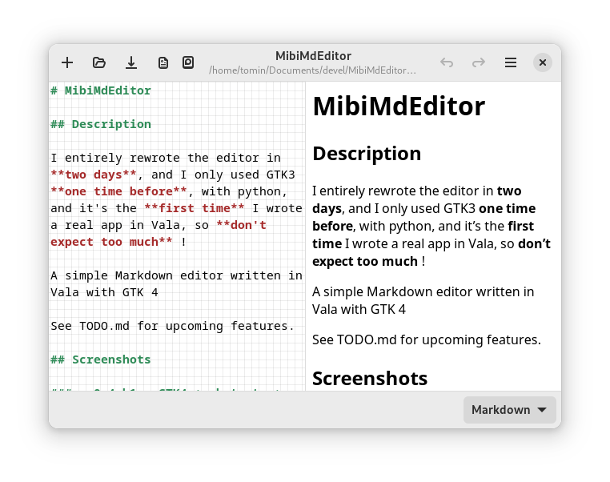
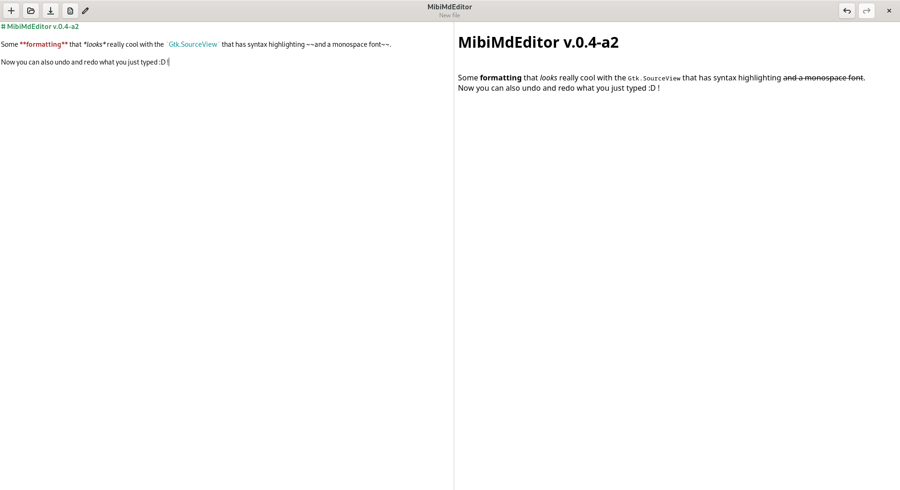
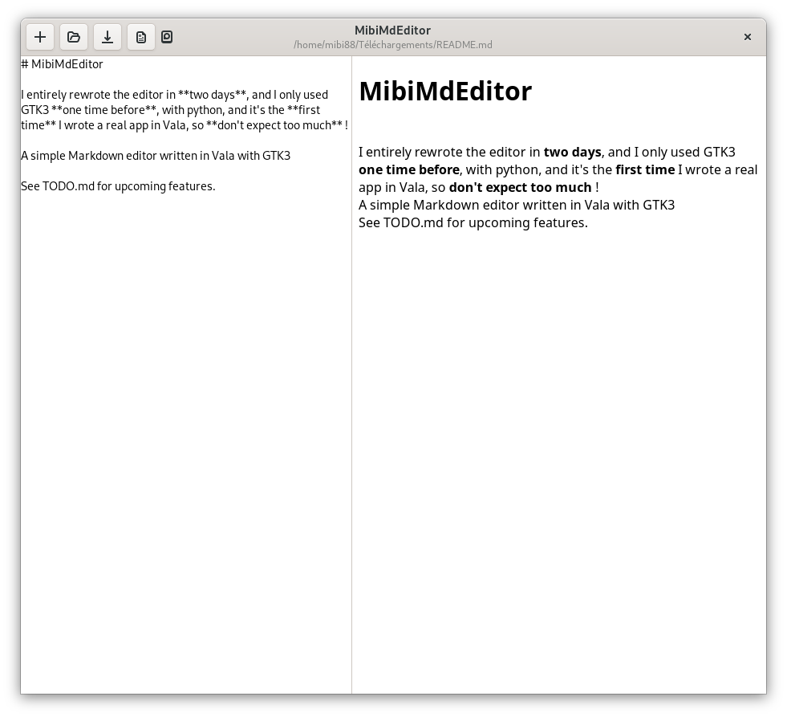

# MibiMdEditor

## Description

A simple Markdown editor written in Vala with GTK 4

See TODO.md for upcoming features.

## Screenshots

### v.0.4-b1 : GTK4 + shotcuts + HTML generation using a script + preferences



### v.0.4-a2 : Syntax highlighting and undo/redo buttons + shotcuts



### v.0.4-a1 : First version of MibiMdEditor written in vala



## Compiling

This project requires

* Vala
* GTK 4
* libadwaita 1
* webkitgtk-6.0
* gtksourceview-5

Compile it using meson :

```
$ meson setup bin
$ cd bin
$ meson compile
$ meson install
```

Then just run the binary in bin/src/.

To get the preview working, you should add or write scripts as explained below. If you don't want to write a script yourself, you can try out the example scripts located in the example_script folder.

## Writing a script to generate HTML

* The input text is in the first argument (the 2nd string of argv in C)
* The output HTML will be grabbed from stdout

When you finished your script

* Go in Preferences > HTML Generation Scripts
* Open "New Script"
* Fill everything out
* Click on the "Save" button
* You should see your script in the list below
* Then, close the Preferences Window
* Check that your script is selected in the little dropdown menu on the bottom of the screen

Then you're ready to write!
